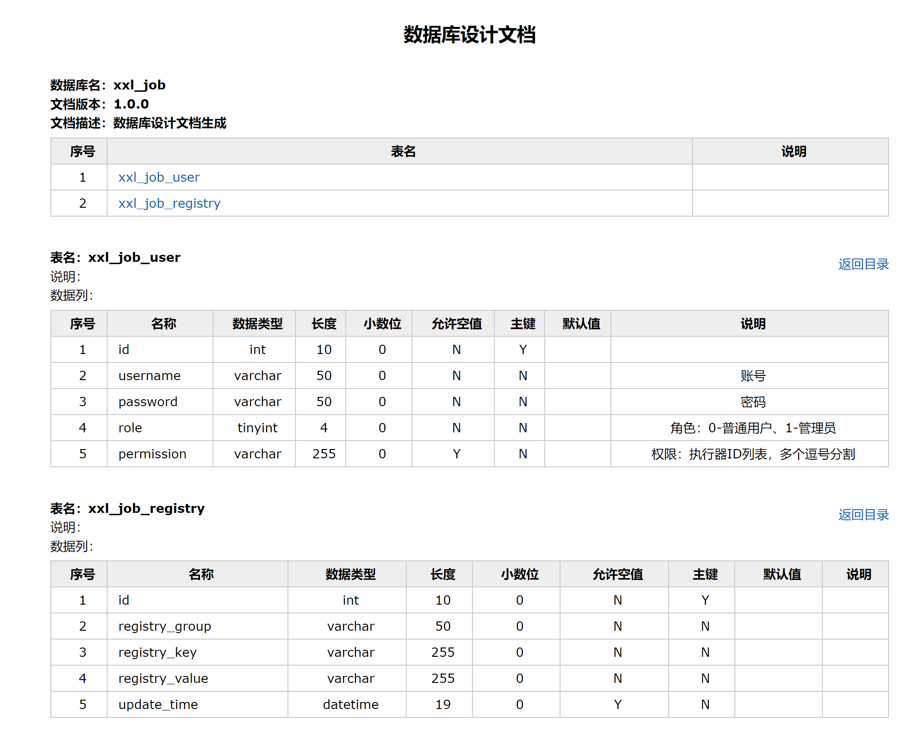

# db-doc
数据库文档生成

## 效果图



## 项目配置
```yaml
spring:
  datasource:
    driver-class-name: com.mysql.cj.jdbc.Driver
    username: ${mysql_user}
    password: ${mysql_pass}
    url: jdbc:mysql://${mysql_host}/${mysql_db}?useUnicode=true&characterEncoding=UTF-8&autoReconnect=true&serverTimezone=Asia/Shanghai


doc:
  fileOutputDir: D:/db-doc
  fileName: 数据库文档
  version: 1.0.0
  description: 数据库设计文档生成

  # 忽略表
  ignoreTableName:
  #  - test_user
   # - test_group

  # 忽略表前缀
  ignorePrefix:
  #  - test_

  # 忽略表后缀
  ignoreSuffix:
   # - _test

  # 根据名称指定表生成
  designatedTableName:
    - xxl_job_user
    - xxl_job_registry
```